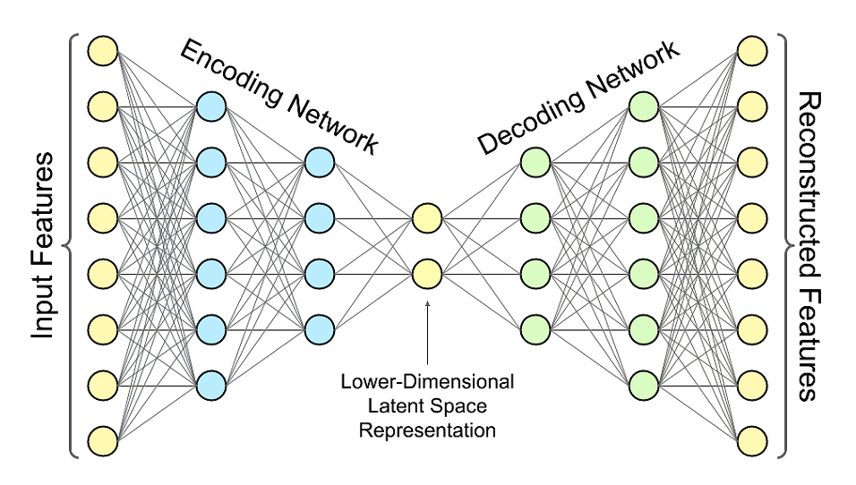
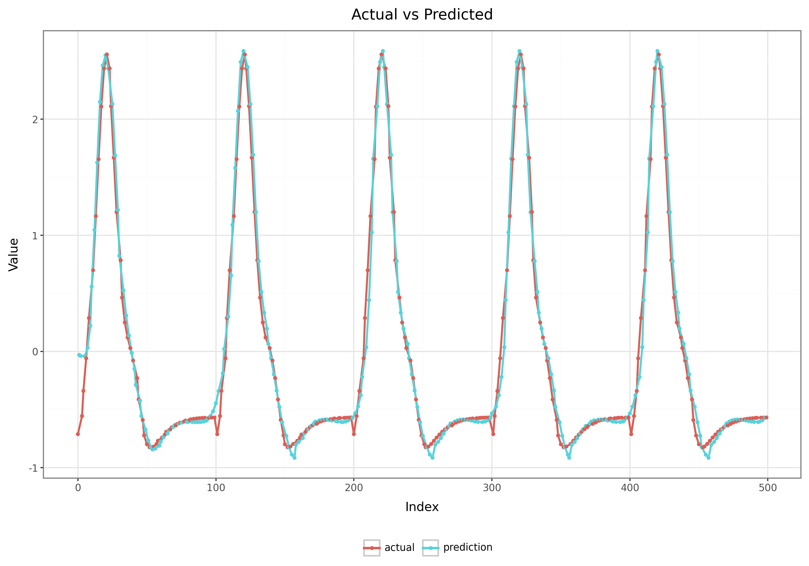

# Lstm-Autoencoder


## Overview

## ⚙️ Installation

A convenient `make` command is provided to install the project.
It will create a virtual environment with the correct python version and install all packages with `poetry`.
In addition, all development tools are installed with `brew` on macOS if they are not already installed.

```bash
make install
```

## 🚧 Usage

Hydra is used to manage the configuration of the project which is stored in `src/lstm_autoencoder/conf`.
The project can be run from the main entry point `src/main.py` with the following command.

```bash
lstm_autoencoder
```
For more information on how to use hydra, please refer to the [documentation](https://hydra.cc/) or run the following command:

```bash
lstm_autoencoder --help
```

## 🧪 Testing

The source code is tested with [pytest](https://docs.pytest.org/en/stable/).
Every node and function should be tested with a unit test.
The tests are located in the `tests` folder where every pipeline step has its own folder.
For more information on how to write tests with pytest the [documentation](https://docs.pytest.org/en/stable/) or the example tests in the `tests` folder can be used as a reference.
You can run your tests as follows:

```bash
make test
```

## Commit Conventions

```bash
commit -m "<type>(<scope>): <description>

[body]

[footer(s)]
"
```

Example:

```bash
commit -m "feat(model): adding new model for training a forecasting model"
```

```bash
commit -m "build: update pandas to version 2.0"
```

Type of commit:
- **fix**: Bugfixes
- **feat**: New features
- **refactor**: Code change that neither fixes a bug nor adds a feature
- **docs**: Documentation-only changes
- **test**: Addition or correction of tests
- **build**: Changes of build components or external dependencies, like pip, docker ...
- **perf**: Code changes that improve the performance or general execution time
- **ci**: Changes to CI-configuration files and scripts
- **style**: Code style changes

Optional commit:
- **scope**: Context of the change
- **body**: Concise description of the change.
- **footer**: Consequences, which arise from the change

## Model Architecture

The model architecture is based on a simple LSTM autoencoder. The implemented model architecture can be found in the script [src/lstm_autoencoder/models/autoencoder.py](https://github.com/marloncz/lstm-autoencoder/blob/main/src/lstm_autoencoder/models/autoencoder.py).



Model Params based on default config [main.yaml](https://github.com/marloncz/lstm-autoencoder/blob/main/src/lstm_autoencoder/conf/main.yaml):

| Name    | Type            | Params | Mode  |
|:--------|:----------------|:-------|:------|
| encoder | Encoder         | 66.0 K | train |
| decoder | Decoder         | 75.0 K | train |
| loss    | WeightedMSELoss | 0      | train |
|---------|-----------------|--------|-------|

```bash
141 K     Trainable params
0         Non-trainable params
141 K     Total params
0.564     Total estimated model params size (MB)
```

## Results

The pipeline that can be started with `lstm_autoencoder` was tested with simulated data.

For the following results, the parameters listed below were used.

```bash
data:
  scaler_name: "scaler"
  window_prep:
    window_size: 60
    window_shift: 1
    split_model_method: "kendall"
    split_model_th: 0.9
    split_model_th_aux: 0.9
model:
  train_params:
    batch_size: 256
    shuffle: False
    min_epochs: 10
    max_epochs: 100
    train_device: "cpu"
    train_workers: 1
    load_workers: 0
inference:
  use_averaging: False
```

The data is simulated using the `simulate_ecg_data` function. No noise was added to the data, which allows for an almost perfect fit between the predicted and actual values.


